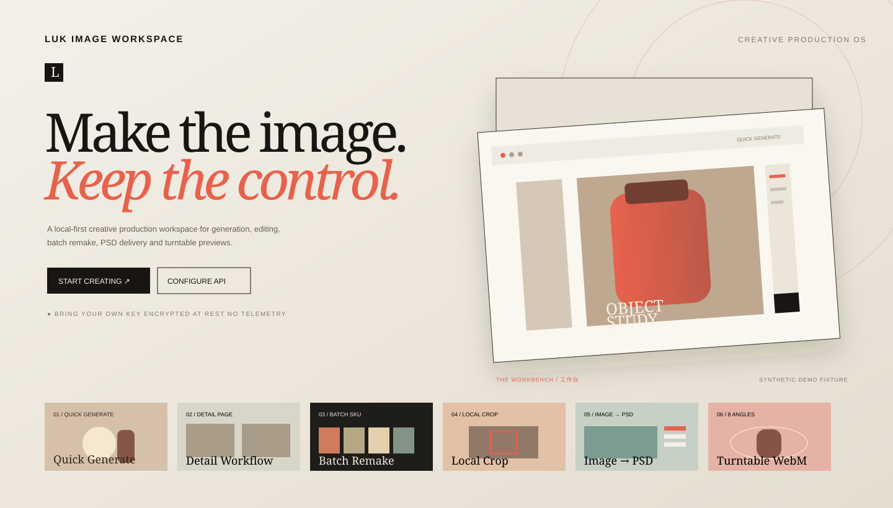
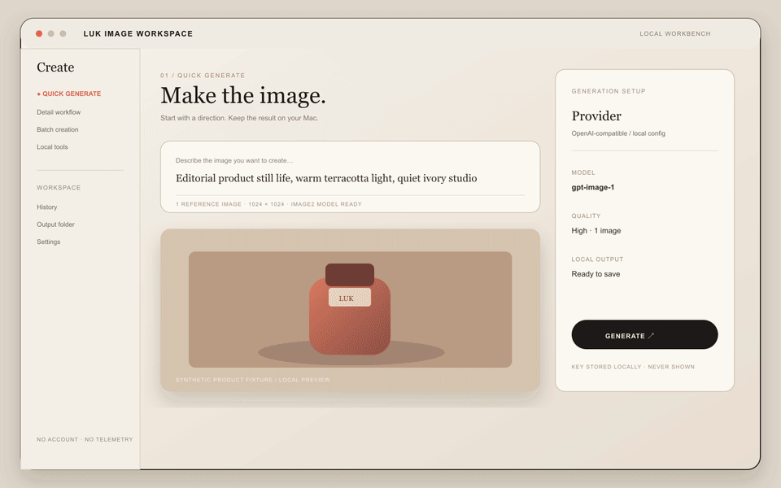
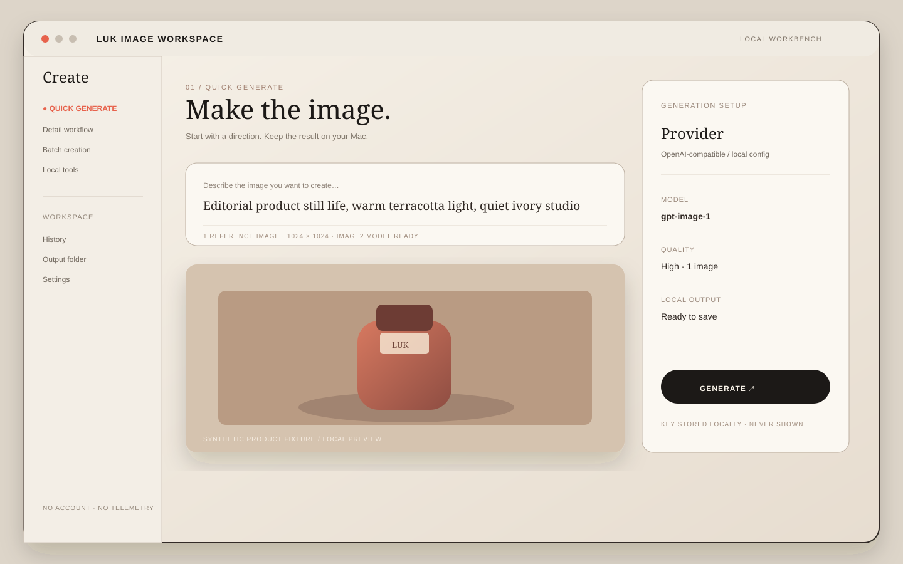
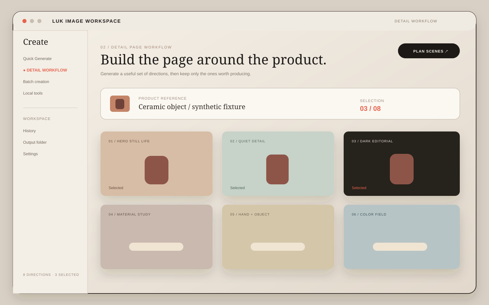
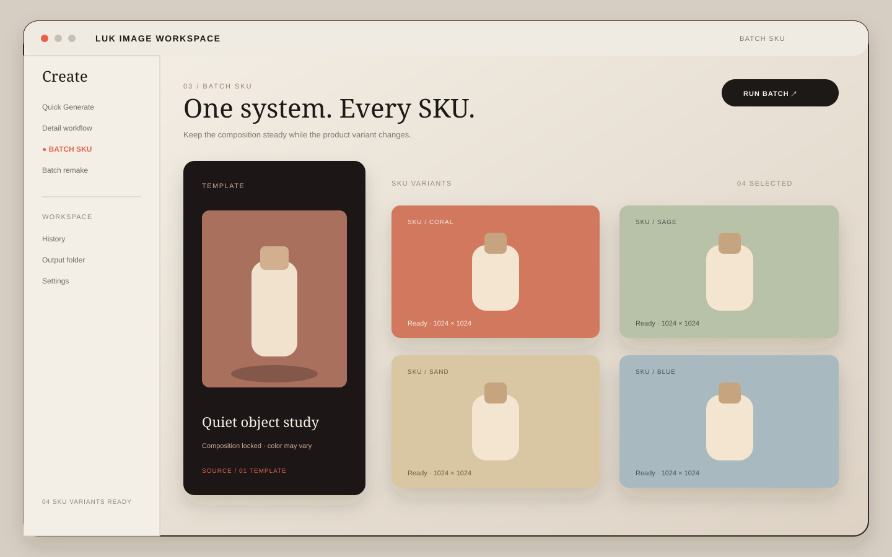
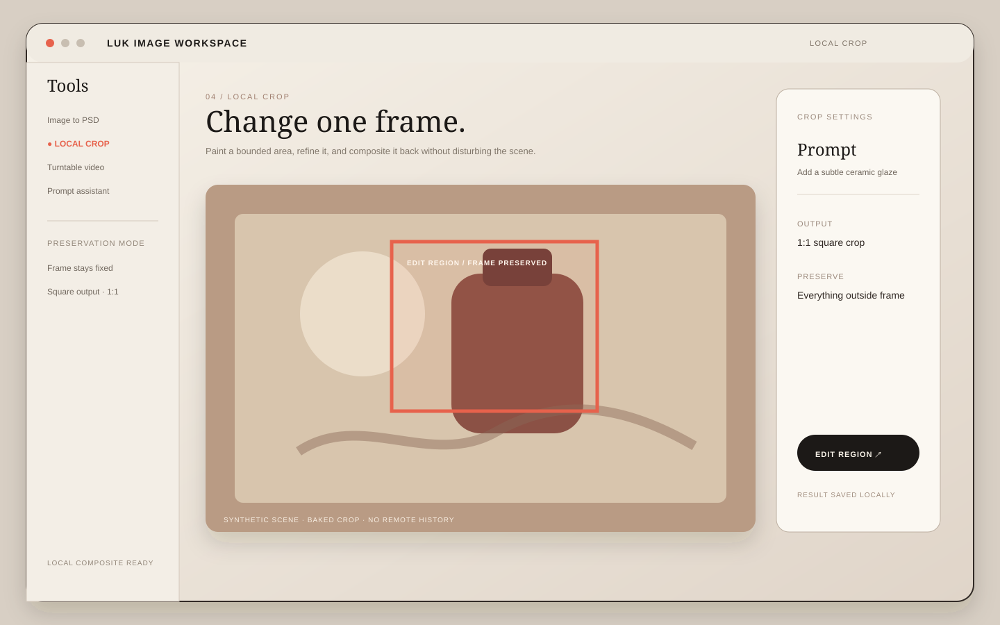
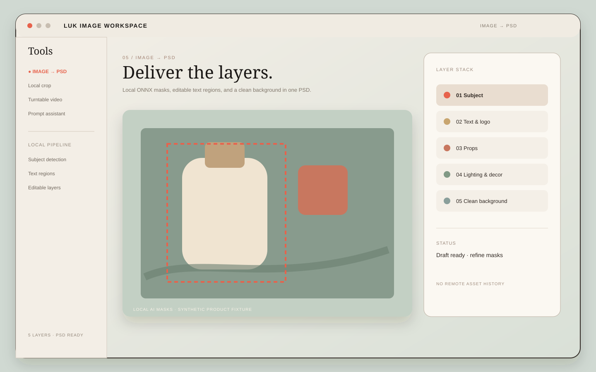
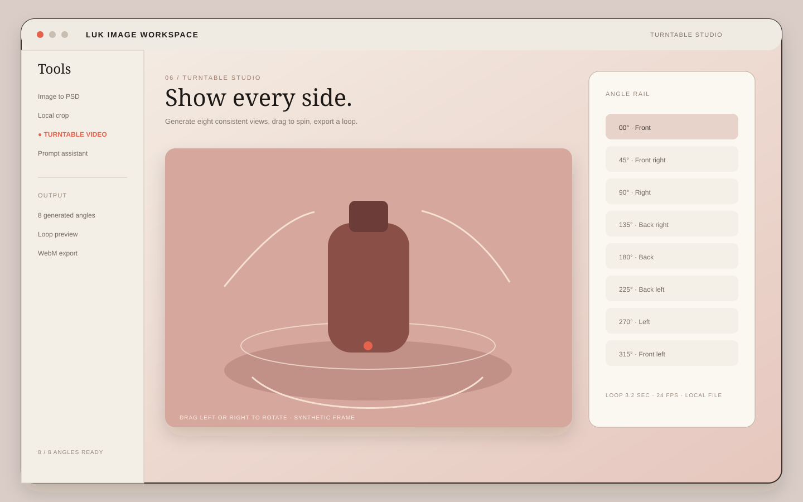

# LUK Image Workspace

**Creative Production OS for macOS — private by design.**

LUK Image Workspace is a local-first desktop studio for image generation and production delivery. Bring your own API key, create through an OpenAI-compatible Images API, and keep the durable result on your Mac.

[](https://github.com/jeffloo886/LUK-image-workspace/actions/workflows/ci.yml) [](https://github.com/jeffloo886/LUK-image-workspace/releases/latest) [](LICENSE)



The desktop UI is English-only. The first launch opens a product Showcase; choose **Start creating** to enter the workbench. You can reopen it from **About / Showcase**.

## Product tour

The demo uses synthetic fixtures only. It contains no real product photos, user paths, provider responses, or credentials.



| Quick Generate | Detail Workflow |
| --- | --- |
|  |  |

| Batch SKU | Local Crop |
| --- | --- |
|  |  |

| Image to PSD | Turntable Studio |
| --- | --- |
|  |  |

[Download the latest Apple Silicon release](https://github.com/jeffloo886/LUK-image-workspace/releases/latest) · [View the changelog](CHANGELOG.md)

## What it does

- Quick Generate — text-to-image and image-to-image.
- Detail Page Workflow — plan scenes, select the useful ones, then produce.
- Batch Remake / SKU — reuse one visual system across many references.
- Local Crop — send a baked crop edit and composite it back into the original scene locally.
- Image → PSD — local AI-assisted layer extraction and editable PSD export.
- 8-angle Turntable — generate eight views, preview the spin, and export WebM.
- Local queue and local history — no account, credits, recharge flow, remote task polling, or remote delete.

## Privacy boundary

The application is BYOK (Bring Your Own Key):

1. The API key is accepted by the Electron main process and encrypted with the operating system-backed `safeStorage` facility.
2. The renderer receives only `hasApiKey` and a short mask; the key is never written to `localStorage`, ordinary settings, logs, screenshots, demo fixtures, issues, releases, or this repository.
3. Provider API requests are made only to the normalized API origin you enter. The main process sends `Authorization: Bearer …` to that origin and there is no browser-side API fallback. The key is not sent to the project author, GitHub, OpenAI/Codex, analytics, or any hidden service. If the provider returns a temporary image URL on another CDN origin, LUK downloads that URL without attaching your key.
4. Generated images are immediately written to the selected local output directory. History stores local paths, hashes, prompts, and necessary metadata; signed remote URLs and base64 results are not persisted.
5. There is no telemetry, crash upload, usage analytics, hidden endpoint, or implicit report-back.

Photopea is different: it is a third-party remote editor. A file is sent to Photopea only after you explicitly choose **Open in Photopea**. The app does not claim that a Photopea edit is local-only.

## OpenAI-compatible Images API

Configure these fields in **Settings**:

| Field | Example |
| --- | --- |
| API Base URL | `https://your-provider.example/v1` |
| API Key | stored encrypted locally; never shown in full |
| Image2 Model | `gpt-image-1` or your provider’s model name |

The app normalizes a provider root URL and a `/v1` URL, then calls:

- `GET /v1/models` for **Test connection**;
- `POST /v1/images/generations` for text-to-image;
- `POST /v1/images/edits` for image-to-image, batch remake, SKU, local crop, and turntable requests.

Both JSON `data[].b64_json` and `data[].url` responses are supported. Edit requests use multipart `image[]` parts and support multiple source images. If a provider does not implement `/images/edits`, LUK reports that capability error directly; it does not fall back to a private login API.

The protocol shape follows the public [Images generation reference](https://developers.openai.com/api/reference/resources/images/methods/generate) and [Images edit reference](https://developers.openai.com/api/reference/resources/images/methods/edit).

## Local demo — no real key required

The repository includes a deterministic mock provider. It accepts a fake key only to exercise the same Bearer-auth shape; it never logs request headers or bodies.

```bash
npm ci
npm run demo:server
```

In another terminal:

```bash
npm run dev
```

Use these Settings values:

```text
API Base URL:  http://127.0.0.1:8787/v1
API Key:       demo-local-only
Image2 Model:  mock-image2
```

The mock server implements `/v1/models`, `/v1/images/generations`, and `/v1/images/edits`. It returns a bundled synthetic fixture so demos and screenshots never contain a real user, product, path, or credential.

## Development

```bash
npm ci
npm run typecheck
npm test
npx electron-vite build
```

`npm run build` additionally verifies the bundled local model helpers and native macOS utilities. An arm64 directory package can be built with:

```bash
npm run package:arm64
```

The app may download local model assets as part of the full build. The mock Images API never requires a model download.

## Repository map

```text
src/main/                     Electron main process, secure provider bridge, local file pipeline
src/preload/                  typed, narrow contextBridge surface
src/renderer/src/api.ts       renderer API client with no network fallback
src/renderer/src/App.vue      local queue, history, workbench shell
src/renderer/src/components/ShowcaseView.vue
examples/mock-openai-server/  no-secret local Images API demo
docs/media/                   synthetic, privacy-safe product visuals
```

## Limitations

- The first release targets OpenAI-compatible Images API semantics, not arbitrary provider SDKs.
- Provider-specific authentication, billing, moderation, and model capabilities remain the provider’s responsibility.
- Remote `url` responses must remain reachable long enough for the main process to download them; once saved locally, the result no longer depends on that URL.
- Local history intentionally does not retain original reference bytes for automatic re-upload after a restart. Re-select source images when re-running a failed request.
- Photopea requires an explicit user action and its own network service.

The product is local-first and provider-neutral: your API key is sent only to the endpoint you configure and confirm, while generated results are materialized on your Mac. There is no account, credit, recharge, or remote-history flow.

## OSS readiness

See [CONTRIBUTING.md](CONTRIBUTING.md), [SECURITY.md](SECURITY.md), [CODE_OF_CONDUCT.md](CODE_OF_CONDUCT.md), [CHANGELOG.md](CHANGELOG.md), and the [OSS evidence checklist](docs/OSS_EVIDENCE.md). OSS demos and release notes must use synthetic fixtures and aggregate metrics only. Never attach API keys, real customer assets, signed URLs, or personal data to an Issue, pull request, release, or funding application.
